# 📚 DOCUMENTAÇÃO COMPLETA - SISTEMA DECOLATOUR

## 🎯 **VISÃO GERAL DO PROJETO**

O DecolaTour é uma plataforma completa de turismo desenvolvida com arquitetura moderna, separando claramente o back-end (API REST em .NET 9) do front-end (React.js). O sistema permite gestão de pacotes turísticos, reservas, pagamentos e avaliações.

---

## 🏗️ **ARQUITETURA GERAL DO SISTEMA**

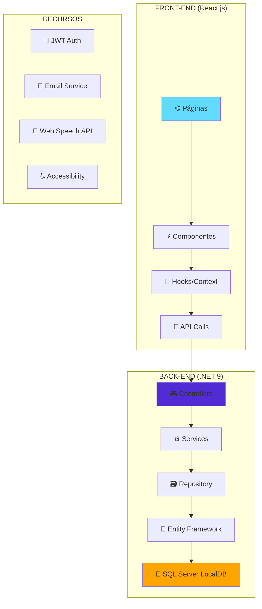

---

## 🗄️ **MODELAGEM DO BANCO DE DADOS**

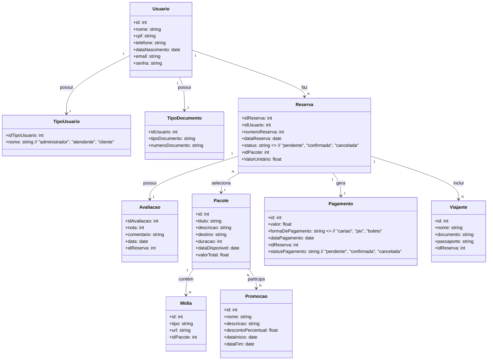

---

## 🔧 **ARQUITETURA DO BACK-END (.NET 9)**

### **📁 Estrutura de Pastas:**

```
backend/
├── 🎮 Controllers/          # Endpoints da API (10 controllers)
├── ⚙️ Services/            # Lógica de negócio (14 services)
├── 🗃️ Repository/          # Acesso a dados (Repository Pattern)
├── 📊 DTOs/               # Data Transfer Objects (29 classes)
├── 🗄️ Models/             # Entidades do banco (19 models)
├── 🔄 Migrations/         # Versionamento do banco
├── 🌐 Interfaces/         # Contratos das dependências
├── 🗺️ Mapper/             # AutoMapper profiles
├── ⚙️ Configuration/      # Configurações (Swagger, DI)
├── 📧 Templates/          # Templates de email
├── 📜 Scripts/            # Scripts SQL de seed
└── 🌍 wwwroot/           # Arquivos estáticos
```

### **🎮 Controllers (Camada de Apresentação):**

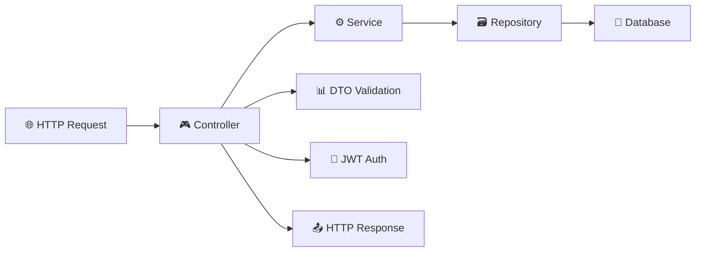

**Controllers Implementados:**
- `AuthController` - Autenticação e autorização
- `UserController` - Gestão de usuários
- `PacotesController` - CRUD de pacotes turísticos
- `ReservaController` - Gestão de reservas
- `PagamentoController` - Processamento de pagamentos
- `AvaliacaoController` - Sistema de avaliações
- `CartaoController` - Gestão de cartões salvos
- `EnderecoController` - Gestão de endereços
- `ViajanteController` - Gestão de viajantes
- `AdminDashboardController` - Painel administrativo

### **⚙️ Services (Camada de Negócio):**

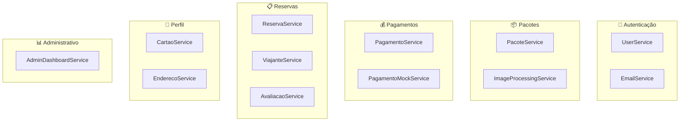

### **🗃️ Repository Pattern:**

```csharp
// Exemplo de interface
public interface IPacoteRepository
{
    Task<List<Pacote>> GetAllAsync();
    Task<Pacote> GetByIdAsync(int id);
    Task<Pacote> CreateAsync(Pacote pacote);
    Task<Pacote> UpdateAsync(Pacote pacote);
    Task DeleteAsync(int id);
}
```

### **🔧 Tecnologias do Back-end:**

| Tecnologia | Versão | Uso |
|------------|--------|-----|
| **.NET** | 9.0 | Framework principal |
| **Entity Framework Core** | 9.0.7 | ORM para banco de dados |
| **AutoMapper** | 12.0.1 | Mapeamento objeto-objeto |
| **BCrypt.Net** | 4.0.3 | Hash de senhas |
| **JWT Bearer** | 9.0.7 | Autenticação JWT |
| **MailKit** | 4.13.0 | Envio de emails |
| **Dapper** | 2.1.66 | Queries SQL otimizadas |

---

## ⚛️ **ARQUITETURA DO FRONT-END (React.js)**

### **📁 Estrutura de Pastas:**

```
front-end/src/
├── 📄 pages/                    # Páginas da aplicação
├── 🧩 components/               # Componentes reutilizáveis
│   ├── 🏠 common/              # Componentes gerais
│   ├── ♿ accessibility/        # Recursos de acessibilidade
│   ├── 📦 package-details/     # Detalhes de pacotes
│   └── 🎨 ui/                  # Componentes de UI
├── 🌐 api/                     # Chamadas para API
├── 🖼️ assets/                  # Imagens e recursos
├── 🎯 hooks/                   # Custom hooks
├── 🗺️ layouts/                 # Layouts das páginas
└── 🎨 styles/                  # Estilos CSS
```

### **📄 Páginas Principais:**

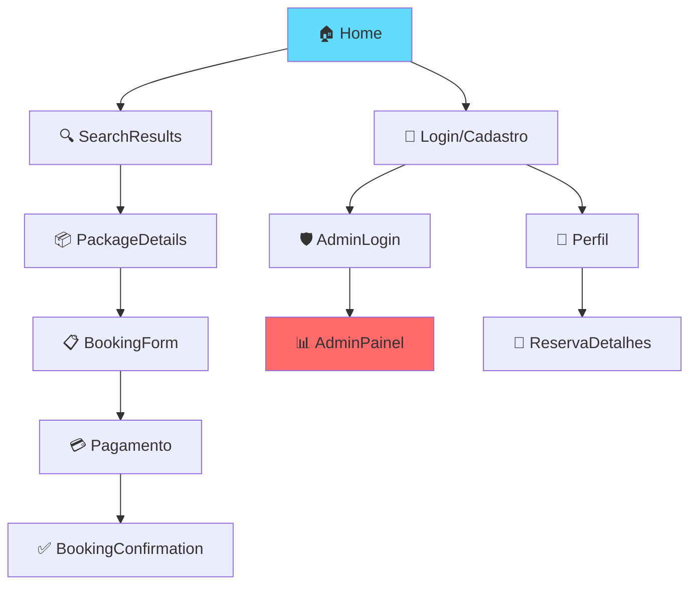

### **🧩 Componentes por Categoria:**

#### **♿ Acessibilidade (WCAG 2.1):**
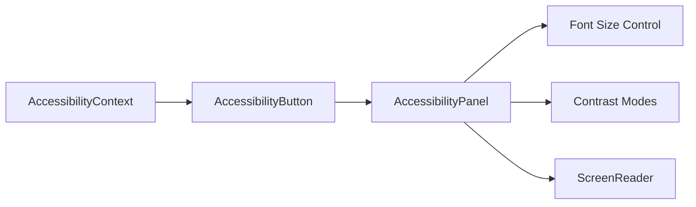

**Recursos de Acessibilidade:**
- 🔤 **Controle de fonte** (0.8x - 1.2x)
- 🎨 **3 modos de contraste** (Alto, Amarelo/Preto, Branco/Amarelo)
- 🔊 **Leitor de tela** com Web Speech API
- ⌨️ **Navegação por teclado**
- 🏷️ **ARIA labels** em todos os elementos

#### **🌐 Integração com API:**
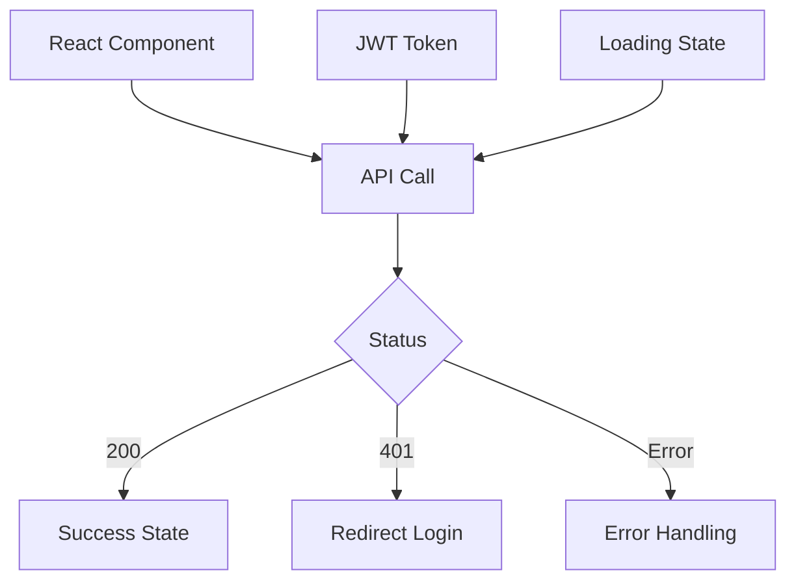

### **🎯 Hooks Customizados:**

```javascript
// Exemplo de hook de acessibilidade
const useAccessibility = () => {
  const [fontSize, setFontSize] = useState(1);
  const [contrastMode, setContrastMode] = useState('none');
  
  return { fontSize, setFontSize, contrastMode, setContrastMode };
};
```

### **🔧 Tecnologias do Front-end:**

| Tecnologia | Versão | Uso |
|------------|--------|-----|
| **React** | 18.3.1 | Framework principal |
| **Vite** | 5.3.4 | Build tool e dev server |
| **React Router** | 6.24.1 | Roteamento SPA |
| **Tailwind CSS** | 3.4.6 | Framework CSS |
| **Lucide React** | 0.400.0 | Ícones |
| **React Icons** | 5.2.1 | Biblioteca de ícones |

---

## 🔐 **SISTEMA DE AUTENTICAÇÃO**

### **🔑 Fluxo de Autenticação JWT:**

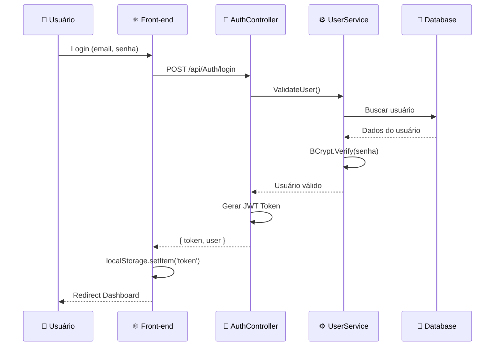

### **🛡️ Middleware de Autorização:**

```csharp
[Authorize] // Requer autenticação
[Authorize(Roles = "Administrador")] // Requer role específica
```

---

## 💳 **SISTEMA DE PAGAMENTOS**

### **💰 Fluxo de Pagamento:**

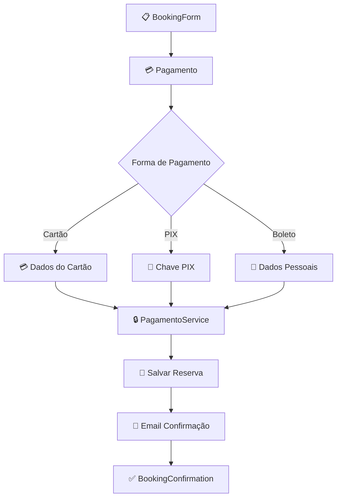

### **🃏 Gestão de Cartões:**

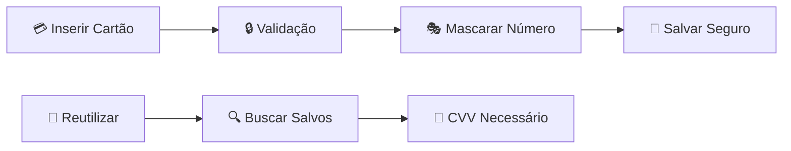

---

## 📧 **SISTEMA DE EMAILS**

### **📮 Templates de Email:**

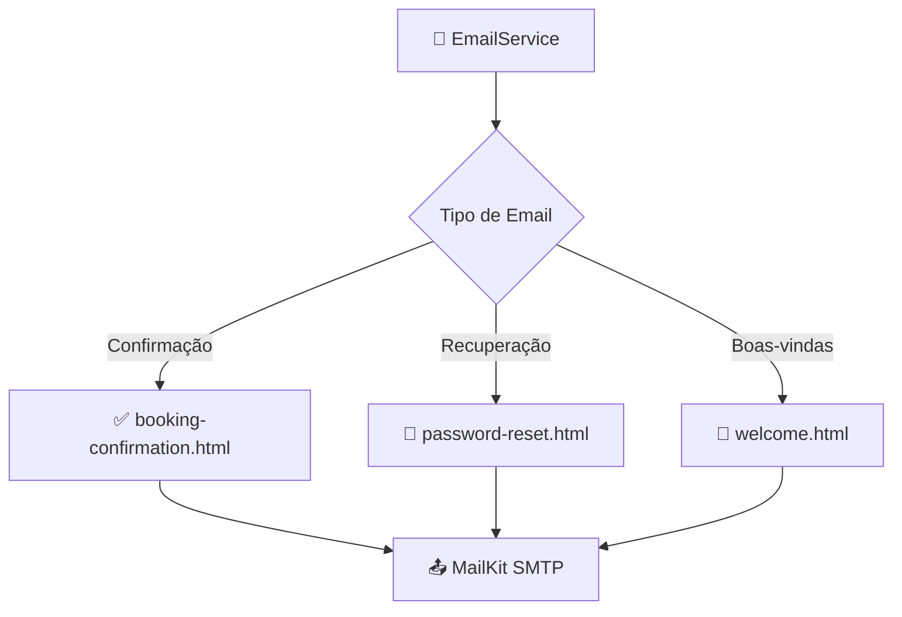

---

## 📱 **RESPONSIVIDADE E DESIGN**

### **🎨 Sistema de Design:**

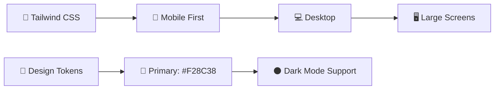

### **📐 Breakpoints:**

| Dispositivo | Tamanho | Classes Tailwind |
|-------------|---------|------------------|
| 📱 Mobile | < 640px | `mobile-first` |
| 📱 Tablet | 640px+ | `sm:` |
| 💻 Laptop | 1024px+ | `lg:` |
| 🖥️ Desktop | 1280px+ | `xl:` |

---

## 🧪 **QUALIDADE E TESTES**

### **✅ Padrões de Qualidade:**

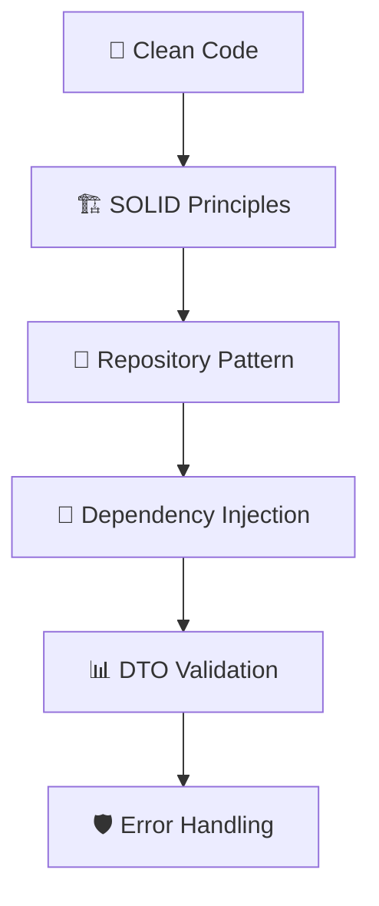

### **🔍 Validações Implementadas:**

- ✅ **Front-end:** Validação em tempo real de formulários
- ✅ **Back-end:** Model validation com Data Annotations
- ✅ **Banco:** Constraints e foreign keys
- ✅ **Autenticação:** JWT validation em todas as rotas protegidas

---

## 🚀 **DEPLOY E AMBIENTES**

### **🌍 Ambientes:**

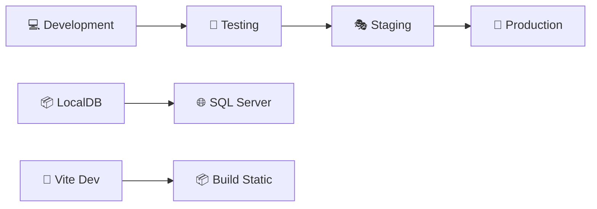

### **⚙️ Configurações por Ambiente:**

| Ambiente | Database | URL | Build |
|----------|----------|-----|-------|
| **Dev** | LocalDB | localhost:5295 | Hot Reload |
| **Prod** | SQL Server | decolatour.com | Optimized |

---

## 📊 **MÉTRICAS E MONITORAMENTO**

### **📈 KPIs do Sistema:**

- 🚀 **Performance:** < 2s loading time
- ♿ **Acessibilidade:** WCAG 2.1 AA compliant
- 📱 **Responsividade:** 100% dispositivos suportados
- 🔒 **Segurança:** JWT + BCrypt + HTTPS
---

### **🧑‍💻 Desenvolvedores:**

- **Back-end:** Arquitetura .NET 9 com Clean Architecture
- **Front-end:** React.js com foco em UX/UI
- **Database:** SQL Server com Entity Framework Migrations


---

**📅 Data da documentação:** 07/08/2025  
**🔄 Última atualização:** Implementação completa do sistema de acessibilidade  
**📝 Responsável:** Equipe DecolaTour
